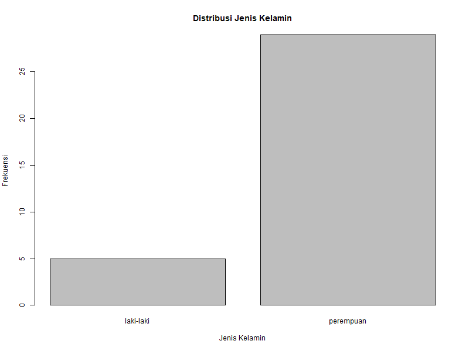
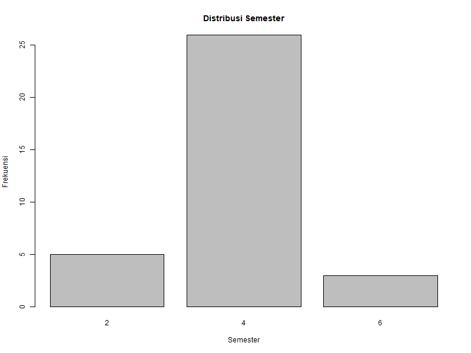

# nonprobability-survey

# Survei Kepuasan Mahasiswa Program Studi Statistika terhadap Penggunaan Google Scholar dalam Pencarian Jurnal Ilmiah

---

# Deskripsi Penelitian

Perkembangan teknologi informasi memberikan pengaruh besar terhadap proses pembelajaran di perguruan tinggi, khususnya dalam memperoleh sumber referensi ilmiah secara online. Mahasiswa saat ini lebih sering memanfaatkan platform digital untuk mencari jurnal, artikel, skripsi, prosiding, dan berbagai publikasi ilmiah lainnya yang mendukung kegiatan akademik.

Salah satu platform yang paling sering digunakan mahasiswa adalah Google Scholar. Google Scholar merupakan layanan pencarian literatur ilmiah yang menyediakan berbagai referensi dari banyak bidang ilmu. Platform ini dianggap mempermudah mahasiswa dalam menemukan sumber referensi hanya dengan menggunakan kata kunci tertentu.

Mahasiswa Program Studi Statistika memerlukan referensi ilmiah yang relevan dan terpercaya untuk membantu proses pembelajaran, penyusunan tugas, praktikum, hingga penelitian. Penggunaan Google Scholar dinilai praktis karena mampu menyediakan banyak pilihan jurnal secara cepat dan mudah diakses kapan saja.

Meskipun demikian, dalam penggunaannya masih terdapat beberapa kendala yang dirasakan mahasiswa, seperti hasil pencarian yang kurang sesuai dengan topik tertentu, banyaknya jurnal yang muncul sehingga menyulitkan proses pemilihan referensi, serta adanya beberapa jurnal yang aksesnya terbatas.

Oleh karena itu, penelitian ini dilakukan untuk mengetahui bagaimana tingkat kepuasan mahasiswa Program Studi Statistika terhadap penggunaan Google Scholar dalam pencarian jurnal ilmiah.

---

# Tujuan Penelitian

1. Mengetahui tingkat kepuasan mahasiswa terhadap penggunaan Google Scholar.
2. Mengetahui kemudahan penggunaan Google Scholar dalam pencarian jurnal ilmiah.
3. Mengetahui manfaat Google Scholar dalam membantu kegiatan akademik mahasiswa.
4. Mengetahui hasil estimasi sederhana menggunakan naive estimation.
5. Mengetahui hasil weighting sederhana pada data survei.

---

# Metode Penelitian

Penelitian ini menggunakan metode non-probability sampling dengan teknik convenience sampling.

Convenience sampling merupakan teknik pengambilan sampel berdasarkan kemudahan peneliti dalam memperoleh responden yang bersedia mengisi kuesioner penelitian. Teknik ini dipilih karena pengumpulan data dilakukan secara online menggunakan Google Form sehingga lebih praktis dan efisien.

---

# Link Kuesioner

Kuesioner penelitian dapat diakses melalui link berikut:

[Klik di sini untuk membuka kuesioner](https://forms.gle/VHFJ2z83TLsiU7hy7)

---

# Variabel Penelitian

| Variabel | Keterangan |
|---|---|
| Semester | Semester mahasiswa responden |
| Jenis Kelamin | Jenis kelamin responden |
| x1 | Kemudahan mengakses Google Scholar |
| x2 | Kemudahan mencari jurnal menggunakan kata kunci |
| x3 | Kecepatan hasil pencarian Google Scholar |
| x4 | Kesesuaian hasil pencarian dengan topik |
| x5 | Banyaknya pilihan jurnal yang tersedia |
| x6 | Google Scholar membantu tugas atau penelitian |
| y | Kepuasan penggunaan Google Scholar secara keseluruhan |

---

# Tools yang Digunakan

- Google Form
- Microsoft Excel
- RStudio
- GitHub

---

# Struktur Repository

```bash
nonprobability-survey/
│
├── data/
│   └── teksam fiks.xlsx
│
├── script/
│   └── analisis.R
│
├── output/
│   ├── grafik-gender.png
│   └── grafik-semester.png
│
└── README.md
```

---

# Import Dataset

```r
library(readxl)

data <- read_excel("C:/Users/ASUS/Documents/abel/teksam fiks.xlsx")
```

Syntax digunakan untuk membaca dataset survei dari file Excel ke dalam RStudio.

---

# Rename Variabel

```r
names(data)[6] <- "x1"
names(data)[7] <- "x2"
names(data)[8] <- "x3"
names(data)[9] <- "x4"
names(data)[10] <- "x5"
names(data)[11] <- "x6"
names(data)[12] <- "y"
```

Rename variabel dilakukan agar proses analisis lebih mudah dan syntax menjadi lebih sederhana.

---

# Analisis Frekuensi Jenis Kelamin

```r
table(data$`jenis Kelamin`)

prop.table(table(data$`jenis Kelamin`))*100
```

## Hasil

| Jenis Kelamin | Frekuensi | Persentase |
|---|---|---|
| Perempuan | 29 | 85.3% |
| Laki-laki | 5 | 14.7% |

## Interpretasi

Mayoritas responden dalam penelitian ini berjenis kelamin perempuan sebanyak 85,3%, sedangkan responden laki-laki sebesar 14,7%.

---

# Analisis Frekuensi Semester

```r
table(data$Semester)

prop.table(table(data$Semester))*100
```

## Hasil

| Semester | Frekuensi | Persentase |
|---|---|---|
| Semester 2 | 5 | 14.7% |
| Semester 4 | 26 | 76.5% |
| Semester 6 | 3 | 8.8% |

## Interpretasi

Sebagian besar responden berasal dari semester 4 sebesar 76,5%. Hal ini menunjukkan bahwa mahasiswa semester 4 lebih aktif dalam pengisian survei.

---

# Analisis Deskriptif

```r
mean(data$x1)
mean(data$x2)
mean(data$x3)
mean(data$x4)
mean(data$x5)
mean(data$x6)
mean(data$y)
```

## Hasil Mean

| Variabel | Mean |
|---|---|
| x1 | 4.12 |
| x2 | 3.74 |
| x3 | 4.03 |
| x4 | 3.44 |
| x5 | 3.65 |
| x6 | 4.00 |
| y | 3.79 |

---

# Standard Deviation

```r
sd(data$x1)
sd(data$x2)
sd(data$x3)
sd(data$x4)
sd(data$x5)
sd(data$x6)
sd(data$y)
```

## Hasil Standar Deviasi

| Variabel | Standar Deviasi |
|---|---|
| x1 | 0.64 |
| x2 | 0.75 |
| x3 | 0.72 |
| x4 | 0.70 |
| x5 | 0.73 |
| x6 | 0.65 |
| y | 0.73 |

---

# Interpretasi Analisis Deskriptif

Variabel kemudahan mengakses Google Scholar memiliki nilai rata-rata tertinggi sebesar 4,12. Hal ini menunjukkan bahwa mahasiswa merasa Google Scholar mudah digunakan dan mudah diakses kapan saja.

Variabel kecepatan pencarian memperoleh nilai rata-rata sebesar 4,03 yang menunjukkan bahwa Google Scholar mampu menampilkan hasil pencarian jurnal dengan cepat.

Variabel membantu tugas atau penelitian memperoleh nilai mean sebesar 4,00 sehingga dapat disimpulkan bahwa Google Scholar sangat membantu mahasiswa dalam kegiatan akademik.

Sementara itu, variabel kesesuaian hasil pencarian memiliki nilai mean paling rendah yaitu sebesar 3,44. Hal ini menunjukkan bahwa beberapa mahasiswa masih merasa hasil pencarian belum sepenuhnya sesuai dengan topik yang dicari.

Nilai standar deviasi seluruh variabel berada di bawah 1 sehingga jawaban responden relatif homogen atau tidak terlalu bervariasi.

---

# Visualisasi Data

## Grafik Distribusi Jenis Kelamin



---

## Grafik Distribusi Semester



---

# Naive Estimation

Naive estimation digunakan untuk memperoleh estimasi sederhana berdasarkan proporsi responden yang merasa puas terhadap penggunaan Google Scholar.

Rumus naive estimation:

\[
\hat{P} = \frac{Jumlah\ Responden\ Puas}{Jumlah\ Seluruh\ Responden}
\]

```r
puas <- sum(data$y >= 4)

n <- nrow(data)

naive <- puas/n

naive
```

## Hasil

\[
0.7647 = 76.47\%
\]

## Interpretasi

Hasil naive estimation menunjukkan bahwa sekitar 76,47% responden merasa puas terhadap penggunaan Google Scholar dalam pencarian jurnal ilmiah.

---

# Weighting Sederhana

Weighting digunakan untuk memberikan pembobotan sederhana terhadap sampel berdasarkan proporsi populasi dan proporsi sampel.

Rumus weighting:

\[
w_i = \frac{Proporsi\ Populasi}{Proporsi\ Sampel}
\]

```r
prop_pop <- 0.50

prop_sample <- 0.147

w <- prop_pop/prop_sample

w
```

## Hasil

\[
3.401361
\]

## Interpretasi

Hasil weighting menunjukkan bahwa kelompok laki-laki memperoleh bobot lebih besar karena jumlah responden laki-laki dalam sampel lebih sedikit dibandingkan proporsi populasi yang diasumsikan.

---

# Kesimpulan

Berdasarkan hasil penelitian dapat disimpulkan bahwa mahasiswa Program Studi Statistika secara umum merasa puas terhadap penggunaan Google Scholar dalam pencarian jurnal ilmiah.

Google Scholar dinilai mudah diakses, cepat dalam menampilkan hasil pencarian, serta membantu mahasiswa dalam memperoleh referensi ilmiah untuk tugas dan penelitian.

Hasil naive estimation menunjukkan bahwa sekitar 76,47% responden merasa puas terhadap penggunaan Google Scholar. Selain itu, hasil weighting sederhana menunjukkan adanya perbedaan proporsi antara sampel dan populasi sehingga diperlukan pembobotan untuk memperoleh estimasi yang lebih seimbang.

Meskipun demikian, masih terdapat beberapa kendala terutama pada kesesuaian hasil pencarian dengan topik tertentu. Oleh karena itu, mahasiswa perlu menggunakan kata kunci yang lebih spesifik agar hasil pencarian menjadi lebih relevan.
